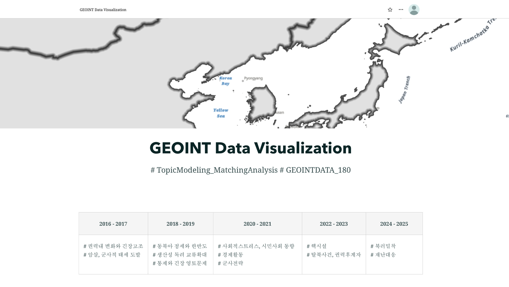

## 📊 Introduction
------

### 헤리티지 보존복원 경력 10년차, 헤리티지 디지털복원 및 GEOINT 공간데이터 분석 시각화 경험을 가진 데이터 분석가입니다. 

## 📊 Experience
------

 Heritage Art Director @ STUDIO KEUM 2018 - 2023

- 문화유산복원, 근현대역사도시 가치평가, 분쟁지역 문화유산 디지털 아카이빙
- 해양유산 관련 공간데이터 분석 및 시각화, 인터랙티브 디자인 전시 작업 수행 

## 📊 Education
------
🏫  M. Eng. in Heritage Conservation & Restoration 2021

## 📊 Skill
------
- Python - Pandas, Numpy, Matplotlib, Sklearn, QL, Machine Learing 
- 🌐ArcGIS Pro/ Online /Story Map, CAD / MadMapper
- 🎬 Adobe After Effects / Premiere Pro

## 📊 Project
------

[OSINT/ GOEINT Data Analysis & Modelling](https://github.com/Kyungdeok-Koo/GeOdyssey)
- Northkorea OSINT/ GOEINT Data Analysis & Modelling

[TopicModelling Based GOEINT Visuliztion Sotrymap](https://www.youtube.com/watch?v=82nhGX_v9rE)
- ArcGIS Pro/ Online /Story Map 

